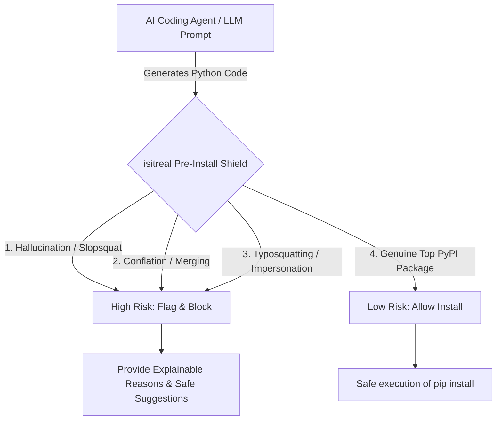

# isitreal — The AI Coding Agent Dependency Security Shield

[](https://pypi.org/project/isitreal/)
[](https://pypi.org/project/isitreal/)
[](https://opensource.org/licenses/MIT)
[](https://sulabhkatila.github.io/isitreal/)
[](#3-model-context-protocol-mcp-server-for-ai-agents)
[](#why-choose-isitreal-the-pre-install-advantage)

**Stop AI Hallucinations, Slopsquatting, Typosquatting, and Dependency Conflation BEFORE `pip install`. Native Model Context Protocol (MCP) Server for Autonomous Coding Agents.**

> [!TIP]
> **🌐 Official Interactive Documentation & Sandbox**: Explore live package verification, interactive slopsquatting simulators, architecture diagrams, explainable risk scoring, and search across all API & CLI references at **[https://sulabhkatila.github.io/isitreal/](https://sulabhkatila.github.io/isitreal/)** (mirror link: [https://sulabhkatila.githu.io/isitreal/](https://sulabhkatila.github.io/isitreal/)).

---

## The Core Problem: Why "Scan After The Fact" Fails AI Coding Agents

When autonomous AI coding agents (**Claude Code**, **Cursor**, **Aider**, **Devin**, **GitHub Copilot**) build software, they generate code and dependencies at superhuman speed. However, Large Language Models (LLMs) suffer from an inherent vulnerability: **dependency hallucination**.

Traditional Software Composition Analysis (SCA) tools—like Dependabot, Snyk, or `pip-audit`—are designed for human workflows. **They scan packages AFTER download and installation.** 

> [!CAUTION]
> **Why post-install scanning is too late:**
> When an AI agent runs `pip install <hallucinated-package>`, Python immediately executes the package's `setup.py`, `pyproject.toml` build hooks, or wheel metadata scripts with **full access to your host system**. If that package is an attacker-controlled slopsquat, your SSH keys, AWS credentials, environment variables, and source code are compromised **before any vulnerability scanner even begins scanning**.

`isitreal` replaces "scan after the fact" with **pre-install verification**: an explainable, real-time security gate that AI agents call *before* writing to `requirements.txt` or executing `pip install`.

---

## Vivid Threat Taxonomy: 4 Supply Chain Attack Vectors in AI Coding

Attackers actively target autonomous coding agents by weaponizing statistical patterns in LLM code generation. `isitreal` defends against four critical threat vectors:



### 1. AI Hallucination Slopsquatting (AI Squatting)
* **The Threat**: LLMs are probabilistic engines. When prompted for niche functionality, they frequently invent plausible-sounding Python package names that do not exist on PyPI (e.g., `react-codeshift`, `django-postgres`, `huggingface-cli`, `python-sqlite3`).
* **The Attack**: Threat actors harvest LLM hallucination logs and pre-register these non-existent package names on PyPI, embedding malicious payloads (reverse shells, crypto-miners, SSH key exfiltrators).
* **The isitreal Defense**: Cross-references every package against PyPI reality and our curated index of known AI hallucination targets, instantly flagging fake libraries as `HIGH RISK`.

### 2. LLM Concept Conflation (Dependency Merging)
* **The Threat**: Neural attention layers often merge two legitimate, highly popular libraries into a single composite name. For example, merging `jscodeshift` and `react-codemod` into `react-codeshift`, or combining `django` and `psycopg2` into `django-postgres`.
* **The Attack**: Because the name looks familiar to both developers and AI agents, conflated slopsquats routinely pass manual code reviews.
* **The isitreal Defense**: Includes a dedicated **Conflation Engine** that analyzes hyphen/underscore-separated tokens against the top 5,000 PyPI packages, exposing concept merging before an agent installs it.

### 3. Typosquatting & Homoglyph Deception
* **The Threat**: Subtle character swaps, hyphen insertions, or suffix omissions (`url-lib3`, `pyyaml-utils`, `scikit-learn-utils`, `requests-html5`).
* **The Attack**: Malicious packages masquerade as official utilities or SDK helpers.
* **The isitreal Defense**: Evaluates package release age (<30 days flag), release counts, and download reputation, immediately identifying low-reputation impersonators and recommending genuine alternatives.

### 4. Unsupervised Agent Execution in CI/CD & IDEs
* **The Threat**: Autonomous agents operating in multi-step loops execute shell commands without human intervention.
* **The Attack**: A single hallucinated import in an automated PR or background agent session compromises the CI/CD runner or developer workstation.
* **The isitreal Defense**: Delivers an automated CI/CD gating flag (`--fail-on high`) and an MCP server that enforces strict pre-install verification rules inside the agent's context window.

---

## Why Choose `isitreal`? The Pre-Install Advantage

| Capability | `pip` / Standard Install | Post-Install SCA Scanners | `isitreal` Shield |
| :--- | :--- | :--- | :--- |
| **Execution Point** | During `pip install` | After `pip install` | **Before any install occurs** |
| **Protects Against `setup.py` Malware** | ❌ No | ❌ No (Too late) | ✅ **Yes (Zero code execution)** |
| **AI Hallucination & Slopsquat Detection** | ❌ No | ❌ Rare / Static CVEs only | ✅ **Native Slopsquat & Conflation Engine** |
| **Offline-Resilient Validation** | ❌ No | ❌ Requires cloud API | ✅ **Bundled Top ~5,000 PyPI Index** |
| **Explainable Security Diagnostics** | ❌ None | ⚠️ CVE codes only | ✅ **Human & AI-readable diagnostic reasons** |
| **AI Agent Native Integration** | ❌ None | ❌ None | ✅ **Official FastMCP Server (Claude / Cursor)** |
| **Fuzzy Alternative Suggestions** | ❌ None | ❌ None | ✅ **Suggests genuine packages automatically** |

---

## AI Agent Integration (Cursor, Claude Code, CLAUDE.md)

`isitreal` is built from the ground up to protect AI coding assistants via the **Model Context Protocol (MCP)**.

### 1. Configure the MCP Server

Add `isitreal` to your AI agent's configuration:

#### Claude Code (`.claude.json` in project root)
```json
{
  "mcpServers": {
    "isitreal": {
      "command": "isitreal-mcp",
      "args": []
    }
  }
}
```

#### Claude Desktop (`~/.config/Claude/claude_desktop_config.json`)
```json
{
  "mcpServers": {
    "isitreal": {
      "command": "isitreal-mcp"
    }
  }
}
```

---

### 2. Add System Instructions (`.cursorrules` or `CLAUDE.md`)

Copy and paste this snippet into your `.cursorrules`, `CLAUDE.md`, or AI custom instructions so your agent never installs unverified packages:

```markdown
## Dependency Security & Hallucination Policy (isitreal)
Before adding any Python dependency to `requirements.txt`, `pyproject.toml`, `setup.py`, or running `pip install`:
1. YOU MUST call the `verify_package` or `verify_dependencies` tool via the `isitreal` MCP server.
2. Inspect the returned `PackageResult`. If `risk == "high"` or `exists == false`:
   - DO NOT install the package.
   - Read the explainable `reasons` field to understand why the package was flagged (e.g., AI hallucination, slopsquatting, or conflation).
   - Use one of the verified legitimate alternatives listed in `suggestions`.
3. NEVER bypass pre-install verification for third-party Python packages.
```

---

## Official Interactive Website & Sandbox

We provide a calm, readable discovery website and live interactive sandbox where you can test package verification without installing anything locally:

* **Official Website**: **[https://sulabhkatila.github.io/isitreal/](https://sulabhkatila.github.io/isitreal/)** *(also accessible via [https://sulabhkatila.githu.io/isitreal/](https://sulabhkatila.github.io/isitreal/))*
* **Live Sandbox & Simulator**: Test package lookups (`requests`, `react-codeshift`, `fancylib`, `django-postgres`) and scan entire `requirements.txt` blocks in your browser.
* **Command Palette (`⌘K`)**: Instant search across all Python APIs, CLI commands, and MCP setup guides.

---

## Installation & Quickstart

Install `isitreal` directly from PyPI:

```bash
pip install isitreal
```

Test a single package in your terminal immediately:

```bash
# Check a legitimate top PyPI library
isitreal check requests

# Check an AI-hallucinated slopsquat target
isitreal check react-codeshift
```

---

## Command Line Interface (CLI) & CI/CD Gating

`isitreal` provides a rich command-line interface for local developer audits and automated CI/CD security pipelines.

### Check a Single Package
```bash
isitreal check django-postgres
```
*Outputs an explainable diagnostic card showing package existence, age, total releases, risk badge, and safety reasons.*

### Scan Dependency Files
Scan `requirements.txt`, `pyproject.toml`, or `setup.cfg` sorted **worst-risk-first**:
```bash
isitreal scan requirements.txt
```

### Automated CI/CD Pipeline Gating (`--fail-on high`)
Block pull requests or CI builds if an AI agent introduces a high-risk or hallucinated dependency:

```bash
# Exits with return code 1 if any package has risk == 'high'
isitreal scan requirements.txt --fail-on high
```

#### GitHub Actions Example (`.github/workflows/security.yml`)
```yaml
name: AI Dependency Security Gate
on: [pull_request]

jobs:
  verify-dependencies:
    runs-on: ubuntu-latest
    steps:
      - uses: actions/checkout@v4
      - name: Set up Python
        uses: actions/setup-python@v5
        with:
          python-version: '3.12'
      - name: Install isitreal
        run: pip install isitreal
      - name: Scan requirements for AI slopsquats
        run: isitreal scan requirements.txt --fail-on high
```

---

## Python API Reference

Use `isitreal` programmatically inside Python applications, custom linting scripts, or agent harnesses:

```python
from isitreal import verify

# 1. Verify a genuine core library
res = verify.package("pydantic")
print(res.exists, res.risk, res.age_days)
# -> True, 'low', 2800

# 2. Verify an AI-hallucinated slopsquat target
res = verify.package("react-codeshift")
print(res.exists, res.risk, res.reasons)
# -> False, 'high', ['Package name is in the known list of AI-hallucinated/slopsquatted packages.', ...]

# 3. Batch scan a requirements file (sorted worst-risk-first)
results = verify.scan("requirements.txt")
for pkg in results:
    if pkg.risk == "high":
        print(f"[BLOCK] {pkg.name}: {pkg.reasons[0]}")
```

### `PackageResult` Data Model
Every verification call returns a structured `PackageResult` dataclass:

| Field | Type | Description |
| :--- | :--- | :--- |
| `name` | `str` | The queried package name. |
| `exists` | `bool` | Whether the package exists on PyPI. |
| `canonical_name` | `str \| None` | Normalized PyPI package name. |
| `latest_version` | `str \| None` | Most recent published version tag. |
| `summary` | `str \| None` | Short summary from PyPI package metadata. |
| `first_release_date` | `str \| None` | ISO-8601 timestamp of earliest published release. |
| `total_releases` | `int` | Total number of published releases on PyPI. |
| `suggestions` | `list[str]` | Curated replacement suggestions if `exists=False` or `risk='high'`. |
| `risk` | `str \| None` | Explainable risk tier: `'low'`, `'unknown'`, `'high'`, or `None` (standard missing). |
| `reasons` | `list[str]` | Clear, bulleted diagnostics explaining why the risk score was assigned. |
| `age_days` | `int \| None` | Package age in days since its initial PyPI release. |

---

## Explainable Risk Scoring Engine

`isitreal` does not rely on opaque "black box" machine learning scores. Every verification is transparent and explainable:

1. **Known Slopsquat Index**: Matches against an actively updated database of documented LLM package hallucinations (`react-codeshift`, `django-postgres`, `python-sqlite3`, `huggingface-cli`).
2. **Conflation Detection**: Analyzes multi-token names (`jscodeshiftreact`, `fastapi-utils-cli`) to detect when an LLM merges two distinct top-tier libraries into one fake package name.
3. **Release Age & Longevity Flagging**: Flags packages published less than 30 days ago (`age_days < 30`) that lack established download reputation.
4. **Download Tier Verification**: Cross-references packages against the top PyPI download indexes and `pypistats` metrics to confirm community trust.
5. **Offline-Resilient Local Cache**: Uses an on-disk SQLite cache (`24h` default TTL) and bundled top-package index so agent loops never stall during network interruptions.

---

## Frequently Asked Questions (FAQ)

### What is "slopsquatting" in Python?
**Slopsquatting** (or AI hallucination squatting) is a supply chain attack where malicious actors monitor code generated by Large Language Models (LLMs) to discover hallucinated package names. Attackers then register those non-existent package names on public registries (PyPI, npm) with malicious install-time scripts (`setup.py`).

### Why do AI coding agents hallucinate package names?
LLMs generate code by predicting tokens that statistically belong together. When an LLM knows two concepts—such as `jscodeshift` and `react-codemod`—it may blend them into a plausible-sounding but non-existent package name like `react-codeshift`.

### Why shouldn't I just use `pip-audit`, Snyk, or Dependabot?
Traditional SCA scanners inspect lockfiles and installed packages **after** installation to check for CVEs in known software. They do not intercept packages **before** installation, nor do they specialize in detecting newly published AI slopsquats that have zero CVEs filed against them. `isitreal` is a **pre-install interception layer** that works alongside your existing CVE scanners.

### Does `isitreal` require an internet connection?
`isitreal` ships with a bundled safety index of the top ~5,000 PyPI packages and maintains a local cache. While live PyPI metadata lookups require network access, verification of core libraries and detection of known slopsquats/conflations degrade gracefully even when offline.

### How do I protect my entire engineering team?
Add `isitreal scan requirements.txt --fail-on high` to your CI/CD pipeline and add the `isitreal` MCP server to your team's shared `.cursorrules` or `.claude.json` file.

---

## License

`isitreal` is open-source software licensed under the **MIT License**.
